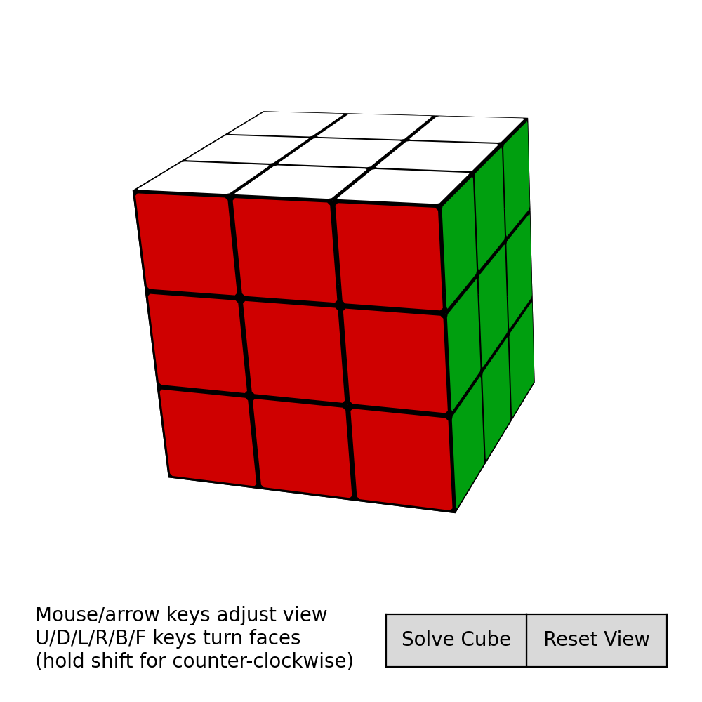

# RubiksCube

Sticker representation
----------------------

 

Each face is represented by a length [5, 3] array:

  [v1, v2, v3, v4, v1]

Each sticker is represented by a length [9, 3] array:

  [v1a, v1b, v2a, v2b, v3a, v3b, v4a, v4b, v1a]

In both cases, the first point is repeated to close the polygon.

Each face also has a centroid, with the face number appended
at the end in order to sort correctly using lexsort.
The centroid is equal to sum_i[vi].

Colors are accounted for using color indices and a look-up table.

With all faces in an NxNxN cube, then, we have three arrays:

  centroids.shape = (6 * N * N, 4)
  faces.shape = (6 * N * N, 5, 3)
  stickers.shape = (6 * N * N, 9, 3)
  colors.shape = (6 * N * N,)

The canonical order is found by doing

  ind = np.lexsort(centroids.T)

After any rotation, this can be used to quickly restore the cube to
canonical position.
